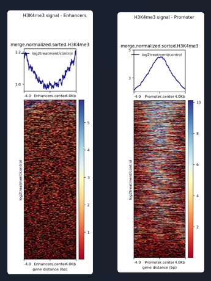

# Introduction
Until now, broadly, three classes of regulatory elements controlling gene expression have been described: promoters, enhancers and boundary elements. This elements switch genes on and off in response to intrinsic and external signals [1].

Enhancers, when activated, appear to make physical contact with the promoters that they control, even though some times, enhancers are pretty far from their respective promoters [1], so DNA-looping is required in order to make this contact possible. This promoter-enhancer interactions are not necessarily done in a 1:1 proportion, since one enhancer can regulate multiple promoters, and a single promoter can be regulated by multiple enhancers, making these promoter-enhancer interactions even more complex.

The first part of the project is to determine if there is a significant difference in the enrichment of the histone H3K4me3 (which is a mark associated with active promoters and transcribed regions) between promoters and  HiC fragments (which most likely will represent enhancers) obtained from inflammatory macrophages. The second part of the project is focused on determining which transcription factors are enriched in both sequence sets (promoters and fragments).

## Defining a histone of interest

  To perform our analysis, it is important to select carefully a target histone. In this case, we have chosen H3K4me3. The biological reason for doing so is that H3K4me3 has been reported associated to increased promoter activity and transcription [2]. Therefore, whilst performing our analysis, we expect this histone to have an increased activity in promoters respective to enhancers.

## ¿Is there Histone enrichment comparing enhancers and fragments?

To detect enrichment for the histone H3K4me3 we will use the command computematrix from the module "deeptools" for computing the signal distribution relative to a certain point of the promoter or enhancer ( reference-point mode). For this, we need two files: the bed , which is a file containing all the positions of interest, and a bigwig, which is a file containing the signal scores of specific regions for the histone of interest.

### Bed files proccessing

To obtain the bed files, we downloaded a zip with the following command:

wget https://www.cell.com/cms/10.1016/j.cell.2016.09.037/attachment/5bc79f6f-1b69-4192-8cb8-4247cc2e0f39/mmc4.zip

These data were taken from the paper:  Lineage-Specific Genome Architecture Links Enhancers and Non-coding Disease Variants to Target Gene Promoters (doi: 10.1016/j.cell.2016.09.037).

```{r eval=FALSE, echo=TRUE}
wget https://www.cell.com/cms/10.1016/j.cell.2016.09.037/attachment/5bc79f6f-1b69-4192-8cb8-4247cc2e0f39/mmc4.zip

wget is a networking command-line tool that lets you download files. You only need to give it the URL of the file of interest [3].
```

Then, we focused on ActivePromoterEnhancerLinks.tsv, which is a file containing interactions between putative promoters and enhancers. It also contains in which cell types a specific interaction occurred and the genomic regions involved. 

As we said before, we will be focused on Mac1 (inflammatory macrophages), so, as first step, we need to filter the ActivePromoterEnhancerLinks.tsv by the word Mac1. For this, we ran the following command:

```{r eval=FALSE, echo=TRUE}
grep Mac1 ActivePromoterEnhancerLinks.cleaned.tsv > M1.tsv

The grep structure <word> <filename> is used to search any line that contains the word in filename. 


```

Once we have filtered the previous file, we can continue.

A bed file is mainly constituted by the chromosome number and the start and end of the region of interest. So, to obtain the bed files we need for further analysis, we ran the following command:

```{r eval=FALSE, echo=TRUE}
awk '{print $1,$2,$3}' M1.tsv > Promoters_data_paper.bed

awk '{print $5,$6,$7}' M1.tsv > Enhancers_data_paper.bed

Awk can be used to search for a specific word when we use /word/. When we are adding '{print $1,$2,$3}', we are saying that we want to print the columns 1,2,3 from the file M1.tsv and save them in the new file Promoters_data_paper.bed.

```

### Removing duplicates 

There are many genomic regions that are duplicated in our bed files, this is probably due to the fact that a single promoter can interact with many enhancers and viceversa. In order to remove this duplicates, we ran the following commands


```{r eval=FALSE, echo=TRUE}
sort Promoters_data_paper_38.bed  | uniq > Promoters_data_paper_uniq_38.bed

We need to sort the bed file because uniq does not detect repeated lines unless they are adjacent [4].

```


### GRCh37 to GRCh38

Given that the positions contained in the bed files are in the version GRCh37, we need to transform this data to the version GRCh38. To do so, we used the following page: https://genome.ucsc.edu/cgi-bin/hgLiftOver

In this page, we need to upload our bed files and indicate the original version of our data and the version to which we want to transform them. What the web page is actually doing is to run the following command:

```{r eval=FALSE, echo=TRUE}

liftOver input.bed hg18ToHg19.over.chain.gz output.bed unlifted.bed

liftOver from UCSC is mainly used for converting genome positions from one genome assembly to another [5]. This command requires a chain file, which contains the liftOver data needed to convert hgX 
 coordinates to hgY, and a unlifted.bed, which will contain all genome positions that cannot be lifted.

```


Once the above is done, we obtain the following files:

```{r eval=FALSE, echo=TRUE}
Promoters_data_paper_uniq_38.bed
Enhancers_data_paper_uniq_38.bed

```

### Downloading the BigWigs

Now we have obtained the final bed files, we can proceed to download the BigWigs with the following commands:

```{r eval=FALSE, echo=TRUE}
(wget http://ftp.ebi.ac.uk/pub/databases/blueprint/data/homo_sapiens/GRCh38/venous_blood/S001MJ/inflammatory_macrophage/ChIP-Seq/NCMLS/S001MJH1.ERX300707.H3K4me3.bwa.GRCh38.20150528.bw ; wget http://ftp.ebi.ac.uk/pub/databases/blueprint/data/homo_sapiens/GRCh38/venous_blood/S001S7/inflammatory_macrophage/ChIP-Seq/NCMLS/S001S7H2.ERX300682.H3K4me3.bwa.GRCh38.20150528.bw ; wget http://ftp.ebi.ac.uk/pub/databases/blueprint/data/homo_sapiens/GRCh38/venous_blood/S0022I/inflammatory_macrophage/ChIP-Seq/NCMLS/S0022IH2.ERX300720.H3K4me3.bwa.GRCh38.20150528.bw ; wget http://ftp.ebi.ac.uk/pub/databases/blueprint/data/homo_sapiens/GRCh38/venous_blood/S001MJ/inflammatory_macrophage/ChIP-Seq/NCMLS/S001MJH1.ERX300715.Input.bwa.GRCh38.20150528.bw ; wget http://ftp.ebi.ac.uk/pub/databases/blueprint/data/homo_sapiens/GRCh38/venous_blood/S001S7/inflammatory_macrophage/ChIP-Seq/NCMLS/S001S7H2.ERX300716.Input.bwa.GRCh38.20150528.bw
wget http://ftp.ebi.ac.uk/pub/databases/blueprint/data/homo_sapiens/GRCh38/venous_blood/S0022I/inflammatory_macrophage/ChIP-Seq/NCMLS/S0022IH2.ERX300717.Input.bwa.GRCh38.20150528.bw)


```

We decided to obtain 3 replicates as in the paper (doi: 10.1016/j.cell.2016.09.037). The samples have the following features:

*S0022I

Sample from a 50 - 55 years old female. Cell-type inflammatory macrophage and tissue-type venous blood.

*S001S7

Sample from a 40 - 45  years old female. Cell-type inflammatory macrophage and tissue-type venous blood.

*S001MJ

Sample from a 55 - 60  years old male Cell-type inflammatory macrophage and tissue-type venous blood.

Both cell type and tissue type are the same as in the paper (doi: 10.1016/j.cell.2016.09.037), also the cell isolation methods used by the paper are the same used in blueprint.

### BigWigs proccesing

The pipeline that blueprint used to transform the fasta files into BigWigs is the following:

#### Mapping

The mapping was carried out using bwa 0.7.7 to human genome GRCh38 reference. The reference file can be found in: ftp://ftp.ebi.ac.uk/pub/databases/blueprint/reference/20150407_reference_files

Command line used:

```{r eval=FALSE, echo=TRUE}

bwa aln -q 5 grch38.fa input.fastq.gz > intermediate.sai

-bwa is a software package for mapping low-divergent sequences against a large reference genome, such as the human genome. Bwa can use different alignment methods such as aln and mem.
  
-aln is a alignment method that is prefered for short reads, as the case, other methods such as mem have a better performance with reads longer than 70bp.

-grch38.fa is the fasta file containing the index

-input.fastq.gz are the chip-seq read to aling.

-intermediate.sai is the output, containing the suffix array coordinate of all short reads loaded in.

[6]

 bwa samse -r "read group information" grch38.fa intermediate.sai input.fastq.gz | samtools view -bS - > output.bam
 
-samse uses the .sai file to generate a SAM file 
 
-the -r option specifies the read group in a format like ‘@RG\tID:foo\tSM:bar’
 
-grch38.fa is the fasta file containing the index
 
-intermediat.sai is the file containing the suffix array coordinate of all short reads loaded in.
 
-input.fastq.gz are the chip-seq read to aling.
 
samse generates a sam file as ouput.

[6]


-samtools view With no options or regions specified, prints all alignments in the specified input alignment file (in SAM, BAM, or CRAM format) to standard output in sample.

-b option is used to indicate that we want the output to be in BAM format.

-S option is used to ignore for compatibility with previous samtools versions.

At the end, we obtain a BAM file.

[7]


```

#### BAM files are sorted and then duplicates marked using picard:

```{r eval=FALSE, echo=TRUE}
java -Xmx2048m -jar picard/SortSam.jar INPUT=input.bam OUTPUT=output.bam SORT_ORDER=coordinate VALIDATION_STRINGENCY=SILENT

-Xmx2048m this argument specifies the maximum memory allocation pool for a Java Virtual Machine (JVM), in this case, it is of 2048 mb.

-picard/SortSam.jar specifies the tool that will be used.

-INPUT specifies the input file.

-OUTPUT specifies the output file name.

-SORT_ORDER specifies that the bam file wil be sorted by coordinates.

-VALIDATION_STRINGENCY.Setting stringency to SILENT can improve performance when processing a BAM file in which variable-length data (read, qualities, tags) do not otherwise need to be decoded.

[8]
```


```{r eval=FALSE, echo=TRUE}

java -Xmx2048m -jar picard/MarkDuplicates.jar INPUT=input.bam OUTPUT=output.bam METRICS_FILE=output.dup_metrics REMOVE_DUPLICATES=false ASSUME_SORTED=true VALIDATION_STRINGENCY=SILENT

-picard/MarkDuplicates.jar indicates the tool that will be used.In this case, this tool locates and tags duplicate reads in a BAM or SAM file.

-METRICS_FILE specifies the file to write duplication metrics to.

-REMOVE_DUPLICATES.If true do not write duplicates to the output file instead of writing them with appropriate flags set.

-ASSUME_SORTED. If true, assume that the input file is coordinate sorted even if the header says otherwise. 

-VALIDATION_STRINGENCY.Setting stringency to SILENT can improve performance when processing a BAM file in which variable-length data (read, qualities, tags) do not otherwise need to be decoded.

[9]

```

#### Filtering

The output bam file was then filtered to remove unmapped reads and reads with Mapping Quality less than 5.

Command line used:

```{r eval=FALSE, echo=TRUE}
samtools view -b -F 4 -q 5 input.bam > intermediate.output.bam

-b specifies the output to be in bam format.

-F specifies that the alignments with the flag 4 will be excluded. In this case, the unmapped reads will be excluded.

-q option says that only reads with mapping quality of at least 5 will be included.

[7]


```

The intermediate output bam file was then filtered to remove PCR or optical duplicate reads

Command line used:

```{r eval=FALSE, echo=TRUE}

samtools view -b -F 1024 intermediate.output.bam > output.bam

-b specifies the output to be in bam format.

-F specifies that the alignments with the flag 1024 will be excluded. In this case, if the read is PCR or optical duplicate will be excluded.

[7]


```

#### Modelling Fragment Size

The fragment size is modelled using the PhantomPeakQualTools R script:

```{r eval=FALSE, echo=TRUE}
run_spp.R -c=output.bam -rf -out=params.out

-c= indicates the full path of the bam file.

-rf do the following: if plot or rdata or narrowPeak file exists replace it. If not used then the run is aborted if the plot or Rdata or narrowPeak file exists.
  
-out= append peakshift result to a file. 

[10]

```

#### Peak Calling

MACS2 (2.0.10.20131216) is used for peak calling with the fragment size predicted by PhantomPeakQualTools. They used both the standard method of running and the -broad flag depending on the mark in question.

Command line used:

```{r eval=FALSE, echo=TRUE}
macs2 callpeak -t chip.bam -n a_sensible_name --gsize hs -c input.bam --nomodel --shiftsize=half_fragment_size --broad

macs2 callpeak -t chip.bam -n a_sensible_name --gsize hs -c input.bam --nomodel --shiftsize=half_fragment_size

-t specifies the treatment file.

-n specifies the string name that macs will use to create the ouput files.

-gsize specifies the effective genome size. In this case it is of 2.7e9.

-c specifies the control file.

-nomodel. While on, MACS will bypass building the shifting model.

-shiftsize specifies the fragment size.

-broad. When this flag is on, MACS will try to composite broad regions in BED12 ( a gene-model-like format ) by putting nearby highly enriched regions into a broad region with loose cutoff. 

[11]
```

The marks where -broad were used are

    H3K27me3
    H3K36me3
    H3K9me3
    H3K4me1

The marks where -broad is omitted are

    H3K27ac
    H3K4me3
    H3K9/14ac
    H2A.Zac
    
#### Wiggle plots

Signal plots are produced using align2RawSignal using the fragment size predicted by PhantomPeakQualTools:

```{r eval=FALSE, echo=TRUE}

align2rawsignal -i=chip.bam -of=bg -o=chip.bg -l fragment_size -s=/path/to/fasta_files -u=/path/to/umap_files

align2rawsignal converts tagAlign/BAM files into normalized signal.

-i specifies the input bam files.

-of specifies the output signal file format. In this case, it is bedGraph 

-o specifies the full path and name of output signal file.

-l specifies the fragment length.

-s specifies the full path and name of output signal file.

-u specifies the full path to directory containing binary mappability tracks.

[12]

```

### BigWigs normalization and merging

Given that Wiggler (align2rawsignal) does not implement input-DNA/control corrections, we decided to normalize our BigWigs files by the input with the tool bigwigCompare from deeptools. The normalization was carried out using the log2 of the ratio of both treatment and input file.
```{r eval=FALSE, echo=TRUE}
bigwigCompare -b1 S001MJH1.ERX300707.H3K4me3.bwa.GRCh38.20150528.bw -b2 S001MJH1.ERX300715.Input.bwa.GRCh38.20150528.bw -o S001MJH1.ERX300715.H3K4me3.normalized.bwa.GRCh38.20150528.bw

-b1 specifies the filename for the treatment.

-b2 specifies the filename for the control.

-o specifies the output filename. BigWig format is set as default.

It is importat to point out that we ran this command for the 3 replicates separately, using the respectives treatment and control files.

[13]

```

Once the normalization was carried out, we proceeded to merge the normalized files. files-merging was carried out assuming that the replicates are similar enough, in fact, other analysis must be done before doing this, but this would take extra-time, so we decided to proceed this way. 

Merging process was done with the following command:

```{r eval=FALSE, echo=TRUE}
bigWigMerge S001MJH1.ERX300715.H3K4me3.normalized.bwa.GRCh38.20150528.bw S001S7H2.ERX300716.H3K4me3.normalized.bwa.GRCh38.20150528.bw S0022IH2.ERX300717.H3K4me3.normalized.GRCh38.20150528.bw merge.normalized.H3K4me3.bedGraph

The first three files are our normalized BigWigs. The last filename is the one that the output will have.

[14]


```

Now we need to convert the merged bedGraph file to a BigWig. To do so, we first sorted the bedGraph file given the recommendations read in biostarts [15].

```{r eval=FALSE, echo=TRUE}

sort -k1,1 -k2,2n merge.normalized.H3K4me3.bedGraph > merge.normalized.sorted.H3K4me3.bedGraph

-k specifies the columns to be sorted.

The -k1,1 notation sets the start and stop limits of the first sort key to the first field.

-n indicates that the columns will be sorted numerically.

bedGraphToBigWig merge.normalized.sorted.H3K4me3.bedGraph GRCh38_EBV.chrom.sizes.tsv merge.normalized.sorted.H3K4me3.bw

This command needs the input bedGraph file, the cromosome sizes file and the output filename.

[15]
 
The file GRCh38_EBV.chrom.sizes.tsv contains the sizes of all the chromosomes. it was downloaded from: https://www.encodeproject.org/files/GRCh38_EBV.chrom.sizes/


```

Now we are ready to run computematrix for both BigWigs

```{r eval=FALSE, echo=TRUE}

 computeMatrix reference-point -S merge.normalized.sorted.H3K4me3.bw -R ./Promoters_data_paper_uniq_38.bed --referencePoint center -a 4000 -b 4000 -out matrix_Promoters_H3K4me3_normalized_matrix.tab.gz

This tool calculates scores per genome regions and prepares an intermediate file that can be used with "plotHeatmap".

-Reference-point refers to a position within the Bed file(e.g., the starting point). In this mode, only those genomic positions before (upstream) and/or after (downstream) of the reference point will be plotted. We used, as first approach, the center of the regions as reference point. The distance upstream and dowstream from the reference point will be of 4000 bp in both cases.

-S specifies the BigWig file containing the scores to be plotted.

-R specifies the file containing the regions to plot.

-out specifies the output name of the matrix.

[16]

```

Now we have the scores per promoters and enhancers regions in two independent matrix. We will plot this information with the command "plotHeatmap" as following:

```{r eval=FALSE, echo=TRUE}

 plotHeatmap -m matrix_Promoters_H3K4me3_normalized_matrix.tab.gz -out H3K4me3_Promoters_normalized.png --heatmapHeight 15 --refPointLabel Promoter.center --regionsLabel Promoters --plotTitle ' H3K4me3 signal - Promoters'

This tool creates a heatmap for scores associated with genomic regions

-m specifes the matrix file from the computeMatrix tool.

-out specifies the file name to save the image to. 

-heatmapHeight specifies the plot height in cm.

-refPointLabel specifies the label shown in the plot for the reference-point.

-regionsLabel specifies the labels for the regions plotted in the heatmap.

-plotTitle specifies the title of the plot to be printed on top of the generated image.

[17]

```

We obtained the following two heatmaps:



As we can see, there is an enrichment for the histone H3K4me3 in promoters since there is a blue track in the heatmap, whereas in the enhancers, almost all the regions exhibit dark to red colors.

### Statiscal analysis

To test whether there is a significant enrichment for histone H3K4me3 in promoter or enhancer regions, we will perform a mean comparison test between both matrix. To do so, we first need to test our data for normality in order to decide for one approach or another.

To test normality, we will use qqplots and a Jarque-Bera test (which performs well with big samples [18]). In order to carry out this approach, we need to reduce the dimensionality of our data, to do so, we decided to calculate the mean of each matrix row. After doing so, we obtained an array containing the means of the normalized signal scores for each promoter and enhancer regions analyzed.

From now on, when we mention Promoters or Enhancers data, we mean the respective arrays containing the averages for each row from both Promoters and Enhancers original matrix.

The following R script will perform what we have said:

```{r message=FALSE, warning=FALSE}
setwd("~/BioinfoII_epig")

#Loading data

Promoters_data<-read.delim("matrix_Promoters_H3K4me3_normalized_uniq_matrix.tab.gz", header = FALSE, sep = "\t",quote = "")

Enhancers_data<-read.delim("matrix_Enhancers_H3K4me3_normalized_uniq_matrix.tab.gz", header = FALSE, sep = "\t",quote = "")

# Converting NAs to 0

Promoters_data[is.na(Promoters_data)] = 0 
Enhancers_data[is.na(Enhancers_data)] = 0

# Removing header

Promoters_data<-Promoters_data[-1,]
Enhancers_data<-Enhancers_data[-1,]

# Removing useless columns 

Promoters_data<-Promoters_data[,-c(1,2,3,4,5,6)]
Enhancers_data<-Enhancers_data[,-c(1,2,3,4,5,6)]

# Calculating the mean for each row in the matrix

Promoters_row_means <- data.frame(ROW_MEANS=rowMeans(Promoters_data))
Enhancers_row_means <- data.frame(ROW_MEANS=rowMeans(Enhancers_data))

# Generating the qqplot
qqnorm(Promoters_row_means$ROW_MEANS, pch = 19, col = "blue",main="Promoters")
qqline(Promoters_row_means$ROW_MEANS)

qqnorm(Enhancers_row_means$ROW_MEANS, pch = 19, col = "red",main="Enhancers")
qqline(Enhancers_row_means$ROW_MEANS)

# Jaquera-Bera test
library("tseries")
jarque.bera.test(x=Promoters_row_means$ROW_MEANS)
jarque.bera.test(x=Enhancers_row_means$ROW_MEANS)

```

From qqplots of both Enhancers and Promoters we conclude that these data are not normal since some dots in both plots do not follow the straight line.

From the Jarque-Bera test, we conclude that both Promoters and Enhancers row means are not normal since both obtain a p-value lower than 2.2e-16.

Given the above, we will use a non-parametric test such as the Wilcoxon test to perform the mean comparison analysis between Enhancers and Promoters.

```{r}
#Wilcoxon test
wilcox.test(Promoters_row_means$ROW_MEANS,Enhancers_row_means$ROW_MEANS,alternative = "two.sided",mu=0, paired=F, conf.int = T, conf.level = 0.99)
```

The Wilcoxon test returned a p-value lower than 2.2e-16, proving that there is a significant difference between the means of both Promoters and Enhancers data. The test returned a 99% confidence interval that goes from 1.682698 to 1.746706, so, given that the sign of the interval is positive, this proves that mean of the Promoters data is greater than the mean of the Enhancers data, proving that there is a significant enrichment for the histone H3K4m3 in promoter regions as expected.


```{r}

```

## ¿What transcription factor is enriched in both promoters and enhancers?

## Using non redundant Jaspar colection

## Using permutations as control sequences

## Conclusion

# Sources

[1] Higgs, D.R. Enhancer–promoter interactions and transcription. Nat Genet 52, 470–471 (2020). https://doi.org/10.1038/s41588-020-0620-7

[2] Liang G, Lin JC, Wei V, Yoo C, Cheng JC, Nguyen CT, et al. (May 2004). "Distinct localization of histone H3 acetylation and H3-K4 methylation to the transcription start sites in the human genome". Proceedings of the National Academy of Sciences of the United States of America. 101 (19): 7357–62. Bibcode:2004PNAS..101.7357L. doi:10.1073/pnas.0401866101. PMC 409923. PMID 15123803.

[3] Mucucho, C. (August 6, 2021). "How To Use Wget to Download Files and Interact with REST APIs". DigitalOcean. retrieved on April 7, 2022. https://www.digitalocean.com/community/tutorials/how-to-use-wget-to-download-files-and-interact-with-rest-apis

[4] M, R., MacKenzie, S. and MacKenzie, D., (2022) . "uniq(1) - Linux manual page" . Man7.org. retrieved on April 7, 2022. https://man7.org/linux/man-pages/man1/uniq.1.html. 
  
[5] Genome.ucsc.edu. (2022). "Lift Genome Annotations#. [online] .retrieved on April 8, 2022. https://genome.ucsc.edu/cgi-bin/hgLiftOver.

[6] Li, H. (2013). "Manual Reference Pages  - bwa (1)". sourceforge. retrieved on April 8, 2022. http://bio-bwa.sourceforge.net/bwa.shtml#12

[7]  Li, H. (2022). "Samtools". htslib. retrieved on April 9, 2022. http://www.htslib.org/doc/samtools.html

[8] GATK team. (2019). "SortSam (Picard)". broadinstitute. retrieved on April 9, 2022. https://gatk.broadinstitute.org/hc/en-us/articles/360036510732-SortSam-Picard-

[9] GATK team. (2019). "MarkDuplicates (Picard)". broadinstitute. retrieved on April 9, 2022. https://gatk.broadinstitute.org/hc/en-us/articles/360037052812-MarkDuplicates-Picard-

[10] kundajelab. (2020). "phantompeakqualtools ". github. retrieved on April 10, 2022. https://github.com/kundajelab/phantompeakqualtools

[11] Mistry, M. Khetani, R. "Peak calling with MACS2". hbctraining. retrieved on April 10, 2022. https://hbctraining.github.io/Intro-to-ChIPseq/lessons/05_peak_calling_macs.html

[12] Kundaje, A. (2015). "align2rawsignal" . github. retrieved on April 11, 2022. https://github.com/akundaje/align2rawsignal

[13] Deeptools. "bigwigCompare" . retrieved on April 11, 2022. https://deeptools.readthedocs.io/en/develop/content/tools/bigwigCompare.html

[14] http://mtweb.cs.ucl.ac.uk/mus/arabidopsis/xiang/software/kent/src/utils/bigWigMerge/bigWigMerge.c

[15] NBIS. "Signal visualisation with deepTools". nbisweden. retrieved on April 12, 2022. https://nbisweden.github.io/workshop-archive/workshop-ChIP-seq/2018-11-07/labs/lab-vis.html

[16] Deeptools. "computeMatrix" . retrieved on April 12, 2022. https://deeptools.readthedocs.io/en/develop/content/tools/computeMatrix.html

[17] Deeptools. "plotHeatmap" . retrieved on April 12, 2022. https://deeptools.readthedocs.io/en/develop/content/tools/plotHeatmap.html

[18] Econometría. (2014). "Prueba de normalidad de Jarque-Bera (JB)". laeconometria. retrieved on April 12, 2022. https://laeconometria.blogspot.com/2014/01/prueba-de-normalidad-de-jarque-bera-jb.html
 

## Modules version 

bwa 0.7.7

samtools 1.4

java 1.8

-picard/SortSam.jar

-picard/MarkDuplicates.jar

phantompeakqualtools 1.1

-run_spp.R

MACS2 2.0.10.20131216

deeptools 2.5.3

-bigwigcompare

-computematrix

-plotheatmap

UCSC-executables/ucsc

-bigwigmerge

-bedgraphtobigwig